```{r setup, include=FALSE}
knitr::opts_chunk$set(echo = FALSE,
                      message=FALSE, 
                      warning=FALSE)

library(fontawesome)
library(tidyverse)
```


- which software package
- what are major concerns?
- 


## Why reproducibility matters

::::{.columns}
:::{.column .purpleBG width="46%"}
**RESEARCHER A:**  
"I baked this cake...

* with **these ingredients** `r fa("egg", height = "20px")``r fa("wheat-awn", height = "20px")``r fa("apple-whole", height = "20px")``r fa("bottle-water", height = "20px")``r fa("jar", height = "20px")`
* and **this recipe** `r fa("clipboard-list", height = "20px")`"

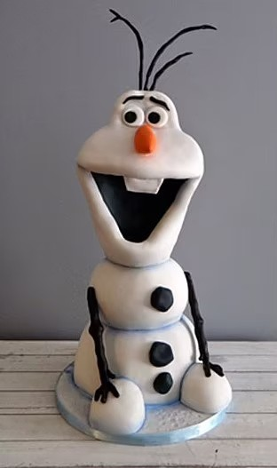{width=250px}
:::

:::{.column width="3%"}
:::

:::{.column .yellowBG width="46%"}
**YOU:**  
"I want that too! So I'll 

* use the **same ingredients** `r fa("egg", height = "20px")``r fa("wheat-awn", height = "20px")``r fa("apple-whole", height = "20px")``r fa("bottle-water", height = "20px")``r fa("jar", height = "20px")`
* and use the **same recipe** `r fa("clipboard-list", height = "20px")`"

{width="250px"}
:::
::::


## Why reproducibility matters

::::{.columns}
:::{.column .purpleBG width="46%"}
**RESEARCHER A:**  
"I baked this cake...

* with **these ingredients** `r fa("egg", height = "20px")``r fa("wheat-awn", height = "20px")``r fa("apple-whole", height = "20px")``r fa("bottle-water", height = "20px")``r fa("jar", height = "20px")`
* and **this recipe** `r fa("clipboard-list", height = "20px")`"

{width=250px}
:::

:::{.column width="3%"}
:::

:::{.column .yellowBG width="46%"}
**YOU:**  
"I want that too! So I'll 

* use the **same ingredients** `r fa("egg", height = "20px")``r fa("wheat-awn", height = "20px")``r fa("apple-whole", height = "20px")``r fa("bottle-water", height = "20px")``r fa("jar", height = "20px")`
* and use the **same recipe** `r fa("clipboard-list", height = "20px")`"

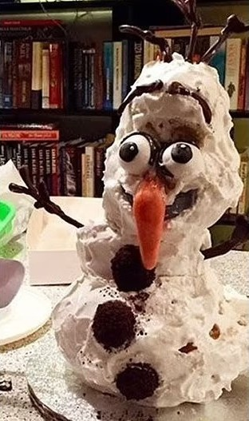{width="250px"}
:::
::::

## Why reproducibility matters
### What is Reproducibility?

\
\

|  | Same Data | Different Data |
|---|---|---|
| **Same Analysis**<br />&nbsp; | <span class="highlight-bright">Reproducible</span> | Replicable |
| **Different Analysis** | Robust | Generalizable |

[@NAS.2018, p. 46]


## Why reproducibility matters
### What is Reproducibility?

\
\

|  | Same Data | Different Data |
|---|---|---|
| **Same Analysis**<br />&nbsp; | <span class="highlight-bright">Reproducible</span> | Replicable |
| **Different Analysis** | Robust | Generalizable |

[@NAS.2018, p. 46]

\

`r fa("arrow-right", height = "30px")` The **cumulative nature of science** fundamentally depends on researchers building upon others’ findings [@merton.1973]

\


> "In principle, all reported evidence should be reproducible" [@Nosek.etal.2022, p. 721]


## Why reproducibility matters
### "Isn't that a given?"

**@Artner.etal.2021**: **232** scientific claims from **46** journal articles
\

```{r}
#| fig-width: 12
#| fig-height: 7
#| fig-align: center
#| fig-dpi: 300
#| out-width: "80%"

artner <- data.frame(what = factor(c("scientific claims",
                                     "reproducible",
                                     "reproducible (strict)",
                                     "reproducible (strict) \n& procedure of paper"),
                                   levels = c("scientific claims",
                                     "reproducible",
                                     "reproducible (strict)",
                                     "reproducible (strict) \n& procedure of paper")),
                     count = c(232, 163, 137, 119),
                     percent = c("100 %", "70 %", "59 %", "51 %"))

ggplot(artner, aes(x=what, y=count)) +
  stat_summary(fun=mean, colour="#ff4c4c", geom="line", aes(group = 1), linewidth = 3) +
  geom_point(size = 6) +
  annotate("text", x = artner$what, y = artner$count - 15, label = artner$percent, size = 6) +
  scale_y_continuous(limits = c(0,235)) +
  xlab("") +
  ylab("count: scientific claims") +
  theme_light() +
  theme(text = element_text(size = 24),
        plot.background = element_rect(fill = "transparent",
                                 color = NA_character_),
        panel.background = element_rect(fill = "transparent",
                                  color = NA_character_))
```


## Why reproducibility matters
### "Isn't that a given?"

::::{.columns}
:::{.column width="50%"}
@Cruwell.etal.2023:  
All articles from one issue in Psychological Science  
`r fa("file-lines", fill="#cc79a7")``r fa("file-lines", fill="#cc79a7")``r fa("file-lines", fill="#cc79a7")``r fa("file-lines", fill="#cc79a7")``r fa("file-lines", fill="#cc79a7")`
`r fa("file-lines", fill="#cc79a7")``r fa("file-lines", fill="#cc79a7")``r fa("file-lines", fill="#cc79a7")``r fa("file-lines", fill="#cc79a7")``r fa("file-lines", fill="#cc79a7")`  
`r fa("file-lines", fill="#f0e442")``r fa("file-lines", fill="#f0e442")``r fa("file-lines", fill="#f0e442")`  
`r fa("file-lines", fill="#009e73")`


  
@Hardwicke.etal.2021:  
Articles, open data badge (Psychological Science, 2014-2015)  
`r fa("file-lines", fill="#cc79a7")``r fa("file-lines", fill="#cc79a7")``r fa("file-lines", fill="#cc79a7")``r fa("file-lines", fill="#cc79a7")``r fa("file-lines", fill="#cc79a7")`
`r fa("file-lines", fill="#cc79a7")``r fa("file-lines", fill="#cc79a7")``r fa("file-lines", fill="#cc79a7")``r fa("file-lines", fill="#cc79a7")``r fa("file-lines", fill="#cc79a7")`  
`r fa("file-lines", fill="#f0e442")``r fa("file-lines", fill="#f0e442")``r fa("file-lines", fill="#f0e442")``r fa("file-lines", fill="#f0e442")``r fa("file-lines", fill="#f0e442")`
`r fa("file-lines", fill="#f0e442")`  
`r fa("file-lines", fill="#009e73")``r fa("file-lines", fill="#009e73")``r fa("file-lines", fill="#009e73")``r fa("file-lines", fill="#009e73")``r fa("file-lines", fill="#009e73")`
`r fa("file-lines", fill="#009e73")``r fa("file-lines", fill="#009e73")``r fa("file-lines", fill="#009e73")``r fa("file-lines", fill="#009e73")`
   

@Obels.etal.2020:  
36 registered reports that shared both, code and data  
`r fa("file-lines", fill="#cc79a7")``r fa("file-lines", fill="#cc79a7")``r fa("file-lines", fill="#cc79a7")``r fa("file-lines", fill="#cc79a7")``r fa("file-lines", fill="#cc79a7")`
`r fa("file-lines", fill="#cc79a7")``r fa("file-lines", fill="#cc79a7")``r fa("file-lines", fill="#cc79a7")``r fa("file-lines", fill="#cc79a7")``r fa("file-lines", fill="#cc79a7")`
`r fa("file-lines", fill="#cc79a7")``r fa("file-lines", fill="#cc79a7")``r fa("file-lines", fill="#cc79a7")``r fa("file-lines", fill="#cc79a7")``r fa("file-lines", fill="#cc79a7")`  
`r fa("file-lines", fill="#009e73")``r fa("file-lines", fill="#009e73")``r fa("file-lines", fill="#009e73")``r fa("file-lines", fill="#009e73")``r fa("file-lines", fill="#009e73")`
`r fa("file-lines", fill="#009e73")``r fa("file-lines", fill="#009e73")``r fa("file-lines", fill="#009e73")``r fa("file-lines", fill="#009e73")``r fa("file-lines", fill="#009e73")`
`r fa("file-lines", fill="#009e73")``r fa("file-lines", fill="#009e73")``r fa("file-lines", fill="#009e73")``r fa("file-lines", fill="#009e73")``r fa("file-lines", fill="#009e73")`
`r fa("file-lines", fill="#009e73")``r fa("file-lines", fill="#009e73")``r fa("file-lines", fill="#009e73")``r fa("file-lines", fill="#009e73")``r fa("file-lines", fill="#009e73")`
`r fa("file-lines", fill="#009e73")`

:::

:::{.column width="1%"}
:::

:::{.column width="47%"}
:::
::::


## Why reproducibility matters
### "Isn't that a given?" - Why not?

::::{.columns}
:::{.column width="50%"}
@Cruwell.etal.2023:  
All articles from one issue in Psychological Science  
`r fa("file-lines", fill="#cc79a7")``r fa("file-lines", fill="#cc79a7")``r fa("file-lines", fill="#cc79a7")``r fa("file-lines", fill="#cc79a7")``r fa("file-lines", fill="#cc79a7")`
`r fa("file-lines", fill="#cc79a7")``r fa("file-lines", fill="#cc79a7")``r fa("file-lines", fill="#cc79a7")``r fa("file-lines", fill="#cc79a7")``r fa("file-lines", fill="#cc79a7")`  
`r fa("file-lines", fill="#f0e442")``r fa("file-lines", fill="#f0e442")``r fa("file-lines", fill="#f0e442")`  
`r fa("file-lines", fill="#009e73")`


  
@Hardwicke.etal.2021:  
Articles, open data badge (Psychological Science, 2014-2015)  
`r fa("file-lines", fill="#cc79a7")``r fa("file-lines", fill="#cc79a7")``r fa("file-lines", fill="#cc79a7")``r fa("file-lines", fill="#cc79a7")``r fa("file-lines", fill="#cc79a7")`
`r fa("file-lines", fill="#cc79a7")``r fa("file-lines", fill="#cc79a7")``r fa("file-lines", fill="#cc79a7")``r fa("file-lines", fill="#cc79a7")``r fa("file-lines", fill="#cc79a7")`  
`r fa("file-lines", fill="#f0e442")``r fa("file-lines", fill="#f0e442")``r fa("file-lines", fill="#f0e442")``r fa("file-lines", fill="#f0e442")``r fa("file-lines", fill="#f0e442")`
`r fa("file-lines", fill="#f0e442")`  
`r fa("file-lines", fill="#009e73")``r fa("file-lines", fill="#009e73")``r fa("file-lines", fill="#009e73")``r fa("file-lines", fill="#009e73")``r fa("file-lines", fill="#009e73")`
`r fa("file-lines", fill="#009e73")``r fa("file-lines", fill="#009e73")``r fa("file-lines", fill="#009e73")``r fa("file-lines", fill="#009e73")`
   

@Obels.etal.2020:  
36 registered reports that shared both, code and data  
`r fa("file-lines", fill="#cc79a7")``r fa("file-lines", fill="#cc79a7")``r fa("file-lines", fill="#cc79a7")``r fa("file-lines", fill="#cc79a7")``r fa("file-lines", fill="#cc79a7")`
`r fa("file-lines", fill="#cc79a7")``r fa("file-lines", fill="#cc79a7")``r fa("file-lines", fill="#cc79a7")``r fa("file-lines", fill="#cc79a7")``r fa("file-lines", fill="#cc79a7")`
`r fa("file-lines", fill="#cc79a7")``r fa("file-lines", fill="#cc79a7")``r fa("file-lines", fill="#cc79a7")``r fa("file-lines", fill="#cc79a7")``r fa("file-lines", fill="#cc79a7")`  
`r fa("file-lines", fill="#009e73")``r fa("file-lines", fill="#009e73")``r fa("file-lines", fill="#009e73")``r fa("file-lines", fill="#009e73")``r fa("file-lines", fill="#009e73")`
`r fa("file-lines", fill="#009e73")``r fa("file-lines", fill="#009e73")``r fa("file-lines", fill="#009e73")``r fa("file-lines", fill="#009e73")``r fa("file-lines", fill="#009e73")`
`r fa("file-lines", fill="#009e73")``r fa("file-lines", fill="#009e73")``r fa("file-lines", fill="#009e73")``r fa("file-lines", fill="#009e73")``r fa("file-lines", fill="#009e73")`
`r fa("file-lines", fill="#009e73")``r fa("file-lines", fill="#009e73")``r fa("file-lines", fill="#009e73")``r fa("file-lines", fill="#009e73")``r fa("file-lines", fill="#009e73")`
`r fa("file-lines", fill="#009e73")`

:::

:::{.column width="1%"}

:::

:::{.column width="47%"}
`r fa("left-right", fill="#cc79a7", width="30px")` Renaming files\
`r fa("lock", fill="#cc79a7", width="30px")` Hard-coding (absolute) file paths\
\

`r fa("copy", fill="#cc79a7", width="30px")` copy-paste errors\
`r fa("calculator", fill="#cc79a7", width="30px")` wrong rounding\
\

`r fa("box", fill="#cc79a7", width="30px")` Old package versions\
`r fa("computer", fill="#cc79a7", width="30px")` Non-standardized computational environment (e.g., Older software versions)

[@Batinovic.Carlsson.2023]
:::
::::

::: notes
* There is some evidence that this is not just happening **occasionally**. Maybe even more than you think.
* Crüwell were able to re-run the code of **1 of 14** journal articles producing the **same results** as in the paper
* Hardwicke.etal.2021: **9 out of 25**
* Obels: **21 out of 36**
  
* There are many reasons why results are not reproducible
* I would just like to direct your attention to the latter two, with which we are particularly concerned today
* And that is having the right package versions and working in the right environment
* Sometimes - not all the time - if your code was written with older package versions or with an older R version, it will throw you error messages if you'd try to run it now
:::

## Why reproducibility matters
### High cost, if not reproducible
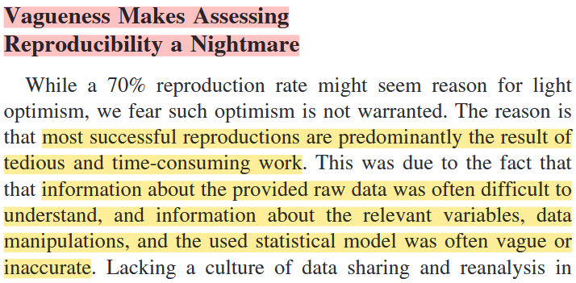  
[@Artner.etal.2021, p. 12]


::: {.notes}
Investment: **280 person-days of work**
:::


## Why reproducibility matters
### Everyday situations in your research process


::::{.columns}
:::{.column .greyBGmargin .text-center .bigger-font width="24%"}
**Joint analyses<br />with co-authors**  
`r fa("people-arrows", height = "90px", prefer_type = "solid")`  
:::

:::{.column .darkgreyBGmargin .text-center .bigger-font width="24%"} 
:::

:::{.column .greyBGmargin .text-center .bigger-font width="24%"} 
:::

:::{.column .darkgreyBGmargin .text-center .bigger-font width="24%"} 
:::
::::


::::{.columns}
:::{.column .greyBGmargin .text-center width="24%"}
`r fa("circle-check", fill = "#79B530", height = "45px", prefer_type = "solid")`  
*System-independent executable*
:::

:::{.column .darkgreyBGmargin .text-center width="24%"}
:::

:::{.column .greyBGmargin .text-center width="24%"}
:::

:::{.column .darkgreyBGmargin .text-center width="24%"}
:::
::::


::::{.columns}
:::{.column .text-center width="24%"}
`r fontawesome::fa("lemon", height = "40px", prefer_type = "solid", fill = "#FFEE8C")`  
*<span class="highlight-bright">Compute environment</span>*  
*<span class="highlight-bright">control</span>*  
:::

:::{.column .text-center width="24%"}  
:::

:::{.column .text-center width="24%"} 
:::

:::{.column .text-center width="24%"} 
:::
::::

## Why reproducibility matters
### Everyday situations in your research process


::::{.columns}
:::{.column .greyBGmargin .text-center .bigger-font width="24%"}
**Joint analyses<br />with co-authors**  
`r fa("people-arrows", height = "90px", prefer_type = "solid")`  
:::

:::{.column .darkgreyBGmargin .text-center .bigger-font width="24%"}
**Reviewers check<br />your analyses**  
`r fa("file-circle-check", height = "90px", prefer_type = "solid")`  
:::

:::{.column .greyBGmargin .text-center .bigger-font width="24%"}
:::

:::{.column .darkgreyBGmargin .text-center .bigger-font width="24%"} 
:::
::::


::::{.columns}
:::{.column .greyBGmargin .text-center width="24%"}
`r fa("circle-check", fill = "#79B530", height = "45px", prefer_type = "solid")`  
*System-independent executable*
:::

:::{.column .darkgreyBGmargin .text-center width="24%"}
`r fa("circle-check", fill = "#79B530", height = "45px", prefer_type = "solid")`  
*Executable<br />free of charge*
:::

:::{.column .greyBGmargin .text-center width="24%"}
:::

:::{.column .darkgreyBGmargin .text-center width="24%"}
:::
::::


::::{.columns}
:::{.column .text-center width="24%"}
`r fontawesome::fa("lemon", height = "40px", prefer_type = "solid", fill = "#FFEE8C")`  
*<span class="highlight-bright">Compute environment</span>*  
*<span class="highlight-bright">control</span>*  
:::

:::{.column .text-center width="24%"}
`r fontawesome::fa("lemon", height = "40px", prefer_type = "solid", fill = "#FFEE8C")`  
*<span class="highlight-bright">Cost-free</span>*  
*<span class="highlight-bright">software</span>*  
:::

:::{.column .text-center width="24%"} 
:::

:::{.column .text-center width="24%"} 
:::
::::


## Why reproducibility matters
### Everyday situations in your research process


::::{.columns}
:::{.column .greyBGmargin .text-center .bigger-font width="24%"}
**Joint analyses<br />with co-authors**  
`r fa("people-arrows", height = "90px", prefer_type = "solid")`  
:::

:::{.column .darkgreyBGmargin .text-center .bigger-font width="24%"}
**Reviewers check<br />your analyses**  
`r fa("file-circle-check", height = "90px", prefer_type = "solid")`  
:::

:::{.column .greyBGmargin .text-center .bigger-font width="24%"}
**Further analysis<br />after review**  
`r fa("pen-to-square", height = "90px", prefer_type = "solid")`  
:::

:::{.column .darkgreyBGmargin .text-center .bigger-font width="24%"} 
:::
::::


::::{.columns}
:::{.column .greyBGmargin .text-center width="24%"}
`r fa("circle-check", fill = "#79B530", height = "45px", prefer_type = "solid")`  
*System-independent executable*
:::

:::{.column .darkgreyBGmargin .text-center width="24%"}
`r fa("circle-check", fill = "#79B530", height = "45px", prefer_type = "solid")`  
*Executable<br />free of charge*
:::

:::{.column .greyBGmargin .text-center width="24%"}
`r fa("circle-check", fill = "#79B530", height = "45px", prefer_type = "solid")`  
*Comprehensible for yourself and others*
:::

:::{.column .darkgreyBGmargin .text-center width="24%"}
:::
::::


::::{.columns}
:::{.column .text-center width="24%"}
`r fontawesome::fa("lemon", height = "40px", prefer_type = "solid", fill = "#FFEE8C")`  
*<span class="highlight-bright">Compute environment</span>*  
*<span class="highlight-bright">control</span>*  
:::

:::{.column .text-center width="24%"}
`r fontawesome::fa("lemon", height = "40px", prefer_type = "solid", fill = "#FFEE8C")`  
*<span class="highlight-bright">Cost-free</span>*  
*<span class="highlight-bright">software</span>*  
:::

:::{.column .text-center width="24%"}
`r fontawesome::fa("lemon", height = "40px", prefer_type = "solid", fill = "#FFEE8C")`  
*<span class="highlight-bright">Literate</span>*  
*<span class="highlight-bright">programming</span>*  
:::

:::{.column .text-center width="24%"}
:::
::::

## Why reproducibility matters
### Everyday situations in your research process


::::{.columns}
:::{.column .greyBGmargin .text-center .bigger-font width="24%"}
**Joint analyses<br />with co-authors**  
`r fa("people-arrows", height = "90px", prefer_type = "solid")`  
:::

:::{.column .darkgreyBGmargin .text-center .bigger-font width="24%"}
**Reviewers check<br />your analyses**  
`r fa("file-circle-check", height = "90px", prefer_type = "solid")`  
:::

:::{.column .greyBGmargin .text-center .bigger-font width="24%"}
**Further analysis<br />after review**  
`r fa("pen-to-square", height = "90px", prefer_type = "solid")`  
:::

:::{.column .darkgreyBGmargin .text-center .bigger-font width="24%"}
**Recalculation<br />for meta-analysis**  
`r fa("chart-gantt", height = "90px", prefer_type = "solid")`  
:::
::::


::::{.columns}
:::{.column .greyBGmargin .text-center width="24%"}
`r fa("circle-check", fill = "#79B530", height = "45px", prefer_type = "solid")`  
*System-independent executable*
:::

:::{.column .darkgreyBGmargin .text-center width="24%"}
`r fa("circle-check", fill = "#79B530", height = "45px", prefer_type = "solid")`  
*Executable<br />free of charge*
:::

:::{.column .greyBGmargin .text-center width="24%"}
`r fa("circle-check", fill = "#79B530", height = "45px", prefer_type = "solid")`  
*Comprehensible for yourself and others*
:::

:::{.column .darkgreyBGmargin .text-center width="24%"}
`r fa("circle-check", fill = "#79B530", height = "45px", prefer_type = "solid")`  
*Executable<br />over the long term*
:::
::::


::::{.columns}
:::{.column .text-center width="24%"}
`r fontawesome::fa("lemon", height = "40px", prefer_type = "solid", fill = "#FFEE8C")`  
*<span class="highlight-bright">Compute environment</span>*  
*<span class="highlight-bright">control</span>*  
:::

:::{.column .text-center width="24%"}
`r fontawesome::fa("lemon", height = "40px", prefer_type = "solid", fill = "#FFEE8C")`  
*<span class="highlight-bright">Cost-free</span>*  
*<span class="highlight-bright">software</span>*  
:::

:::{.column .text-center width="24%"}
`r fontawesome::fa("lemon", height = "40px", prefer_type = "solid", fill = "#FFEE8C")`  
*<span class="highlight-bright">Literate</span>*  
*<span class="highlight-bright">programming</span>*  
:::

:::{.column .text-center width="24%"}
`r fontawesome::fa("lemon", height = "40px", prefer_type = "solid", fill = "#FFEE8C")`  
*<span class="highlight-bright">Compute environment</span>*  
*<span class="highlight-bright">control</span>*  
:::
::::


## Why reproducibility matters
### Everyday situations in your research process


::::{.columns}
:::{.column .greyBGmargin .text-center .bigger-font width="24%"}
**Joint analyses<br />with co-authors**  
`r fa("people-arrows", height = "90px", prefer_type = "solid")`  
:::

:::{.column .darkgreyBGmargin .text-center .bigger-font width="24%"}
**Reviewers check<br />your analyses**  
`r fa("file-circle-check", height = "90px", prefer_type = "solid")`  
:::

:::{.column .greyBGmargin .text-center .bigger-font width="24%"}
**Further analysis<br />after review**  
`r fa("pen-to-square", height = "90px", prefer_type = "solid")`  
:::

:::{.column .darkgreyBGmargin .text-center .bigger-font width="24%"}
**Recalculation<br />for meta-analysis**  
`r fa("chart-gantt", height = "90px", prefer_type = "solid")`  
:::
::::


::::{.columns}
:::{.column .greyBGmargin .text-center width="24%"}
`r fa("circle-check", fill = "#79B530", height = "45px", prefer_type = "solid")`  
*System-independent executable*
:::

:::{.column .darkgreyBGmargin .text-center width="24%"}
`r fa("circle-check", fill = "#79B530", height = "45px", prefer_type = "solid")`  
*Executable<br />free of charge*
:::

:::{.column .greyBGmargin .text-center width="24%"}
`r fa("circle-check", fill = "#79B530", height = "45px", prefer_type = "solid")`  
*Comprehensible for yourself and others*
:::

:::{.column .darkgreyBGmargin .text-center width="24%"}
`r fa("circle-check", fill = "#79B530", height = "45px", prefer_type = "solid")`  
*Executable<br />over the long term*
:::
::::


::::{.columns}
:::{.column .text-center width="24%"}
`r fontawesome::fa("lemon", height = "40px", prefer_type = "solid", fill = "#FFEE8C")`  
*<span class="highlight-bright">Compute environment</span>*  
*<span class="highlight-bright">control</span>*  
:::

:::{.column .text-center width="24%"}
`r fontawesome::fa("lemon", height = "40px", prefer_type = "solid", fill = "#FFEE8C")`  
*<span class="highlight-bright">Cost-free</span>*  
*<span class="highlight-bright">software</span>*  
:::

:::{.column .text-center width="24%"}
`r fontawesome::fa("lemon", height = "40px", prefer_type = "solid", fill = "#FFEE8C")`  
*<span class="highlight-bright">Literate</span>*  
*<span class="highlight-bright">programming</span>*  
:::

:::{.column .text-center width="24%"}
`r fontawesome::fa("lemon", height = "40px", prefer_type = "solid", fill = "#FFEE8C")`  
*<span class="highlight-bright">Compute environment</span>*  
*<span class="highlight-bright">control</span>*  
:::
::::

::::{.columns}
:::{.column .text-center .border-top1 width="100%"}
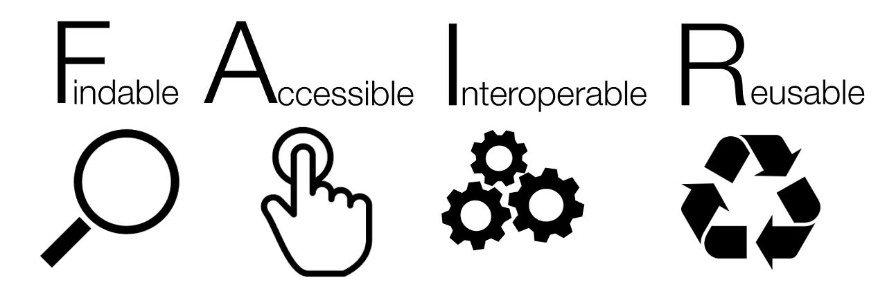{width=250px}
:::
::::


## Low hanging fruits `r fontawesome::fa("lemon", height = "80px", prefer_type = "solid", fill = "#FFEE8C")` {.section-title .dark-slide}

## Basic requirement
### I assume that's a given!


::::{.columns}
:::{.column width = "49%"}
::: {.callout-note}
#### Share data and analyses
see closed_data() function from WORCS or synthpop package in case you can’t share data
:::

\

::: {.callout-note}
#### Set up your work as a ‘project’
where all related files (e.g., data, scripts, results) are stored together in a folder (as with R-projects) or in a single file (as with JASP and jamovi)
:::
:::
:::{.column width = "49%"}
::: {.callout-note}
#### Use a clear folder structure and readme files
see e.g., [PSYCH-DS](https://psych-ds.github.io/) (see technical specification draft)<br />&nbsp;
:::

\

::: {.callout-tip}
The Workflow for [Open Reproducible Code in Science (WORCS)]() is an excellent framework that also integrates recommendations I give here. [@vanlissa.2021]
:::
:::
::::

[@peng.2011]


## Fruit 1 `r fontawesome::fa("lemon", height = "55px", prefer_type = "solid", fill = "#FFEE8C")` Cost-free software
### Script based software

::::{.columns}
:::{.column width = "30%" .text-center}
\

{width=50%}  
**511 - 769 €**
:::


:::{.column width = "5%" .text-center}
\
\

`r fontawesome::fa("arrow-right", height = "60px", prefer_type = "solid")`  
:::


:::{.column width = "30%" .text-center}
<a href="https://www.edx.org/learn/r-programming/harvard-university-data-science-r-basics" target="_blank" class="infobtn">{width="100"}<br /><b>Intro to R</b><br />(edX online course)</a> 
:::

:::{.column width = "30%" .text-center}
<a href="https://www.edx.org/learn/data-science/harvard-university-introduction-to-data-science-with-python" target="_blank" class="infobtn">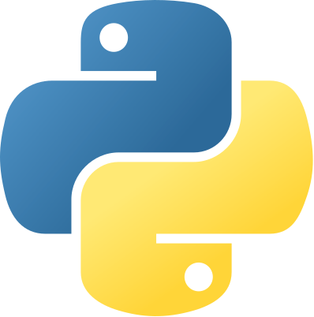{width="100"}<br /><b>Intro to python</b><br />(edX online course)</a> 
:::

::::


## Fruit 1 `r fontawesome::fa("lemon", height = "55px", prefer_type = "solid", fill = "#FFEE8C")` Cost-free software
### Script based software

::::{.columns}
:::{.column width = "30%" .text-center}
\

{width=50%}  
**511 - 769 €**
:::


:::{.column width = "5%" .text-center}
\
\

`r fontawesome::fa("arrow-right", height = "60px", prefer_type = "solid")`  
:::


:::{.column width = "30%" .text-center}
<a href="https://www.edx.org/learn/r-programming/harvard-university-data-science-r-basics" target="_blank" class="infobtn">{width="100"}<br /><b>Intro to R</b><br />(edX online course)</a> 
:::

:::{.column width = "30%" .text-center}
<a href="https://www.edx.org/learn/data-science/harvard-university-introduction-to-data-science-with-python" target="_blank" class="infobtn">{width="100"}<br /><b>Intro to python</b><br />(edX online course)</a> 
:::

::::

### Point-and-click software

::::{.columns}
:::{.column width = "30%" .text-center}
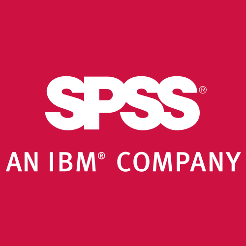{width=50%}  
**from ~117 € per month**
:::


:::{.column width = "5%" .text-center}
\
\

`r fontawesome::fa("arrow-right", height = "60px", prefer_type = "solid")`  
:::


:::{.column width = "30%" .text-center}
<a href="https://www.youtube.com/watch?v=APRaBFC2lEQ" target="_blank" class="infobtn">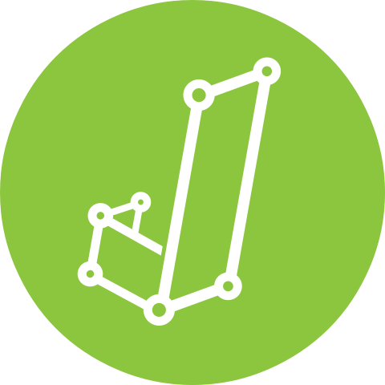{width="100"}<br /><b>Intro to JASP</b><br />(youtube: JASP Statistics)</a> 
:::

:::{.column width = "30%" .text-center}
<a href="https://www.youtube.com/watch?v=mZomeS0tLxY" target="_blank" class="infobtn">{width="100"}<br /><b>Intro to jamovi</b><br />(youtube: freeCodeCamp.org)</a>
:::

::::


::: {.notes}
* Imagine you are the reviewer of a paper and want to rerun the analyses.  
* At the moment, I would not be able to run MPlus code
* I recently switched affiliation to a new university, if I had MPlus code from old projects -> not be able to run 
:::


## Fruit 1 `r fontawesome::fa("lemon", height = "55px", prefer_type = "solid", fill = "#FFEE8C")` Cost-free software

:::: {.columns}
:::{.column width = "8%"}
\
\
\
\
\


:::
:::{.column width = "91%"}
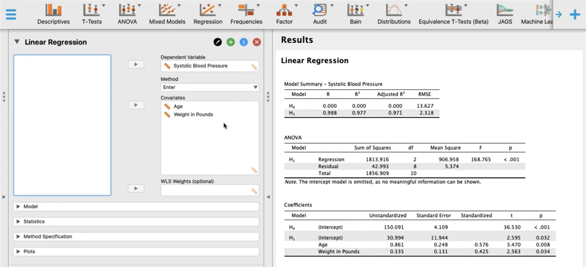  
*also opens .sav-files from SPSS*
:::
::::


## Fruit 1 `r fontawesome::fa("lemon", height = "55px", prefer_type = "solid", fill = "#FFEE8C")` Cost-free software

:::: {.columns}
:::{.column width = "8%"}
\
\
\
\
\


:::
:::{.column width = "91%"}
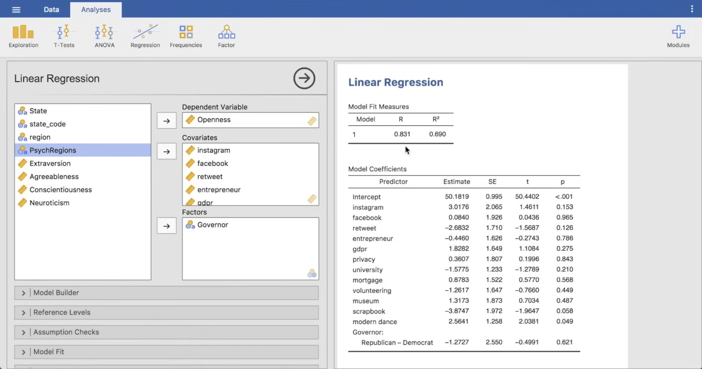  
*also opens .sav-files from SPSS*
:::
::::


## Fruit 2 `r fontawesome::fa("lemon", height = "55px", prefer_type = "solid", fill = "#FFEE8C")` Literate Programming

\

**Concept by Knuth (1984):**

- Interweaving natural language and code
- Human-readable documentation
- Code, output, and narrative in one document

\

**Modern implementation:**


:::: {.columns}
:::{.column width = "15%" .text-center}
*Quarto*  
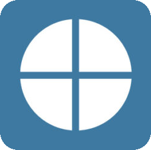{width="75%"}
:::
:::{.column width = "15%" .text-center}
*RMarkdown*  
{width="75%"}
:::
:::{.column width = "15%" .text-center}
*Jupyter Notebooks*  
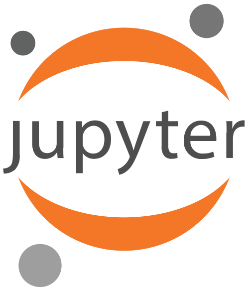{width="75%"}
:::
::::


## Fruit 2 `r fontawesome::fa("lemon", height = "55px", prefer_type = "solid", fill = "#FFEE8C")` Literate Programming
### Example: Quarto Document

**Left side:** Markdown + Code blocks  
**Right side:** Rendered document (HTML, PDF or Word)


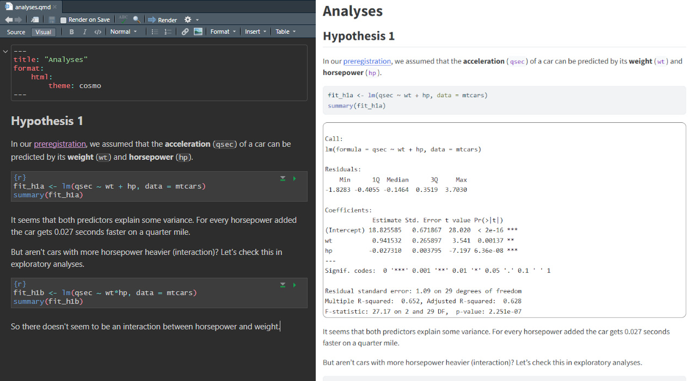{.border1}  

Click here for [an example](https://raw.githack.com/j-5chneider/MoWi-KI/refs/heads/main/analyses/analyses_revision_excl_engagement_ai.html) from one of my papers.


## Fruit 2 `r fontawesome::fa("lemon", height = "55px", prefer_type = "solid", fill = "#FFEE8C")` Literate Programming
### Example: JASP

**Add notes** to improve comprehensibility of your output  
**Also works** with jamovi  

:::: {.columns}
:::{.column width = "50%" .text-center}
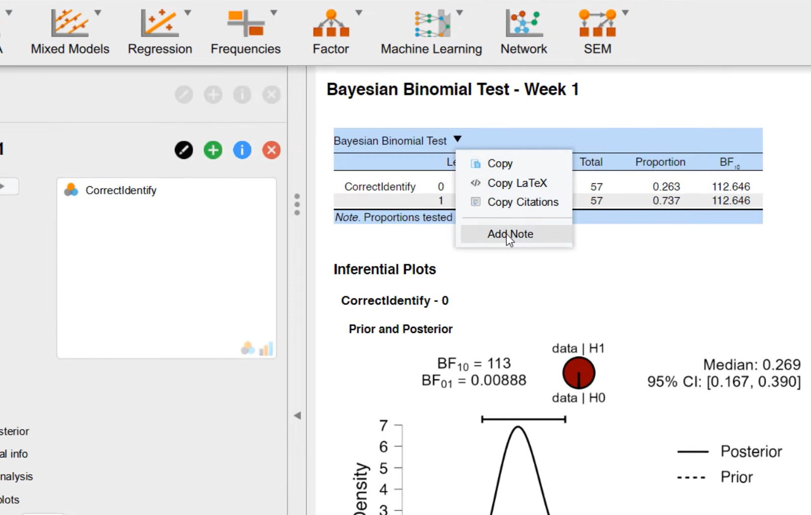{.border1}
:::
:::{.column width = "50%" .text-center}
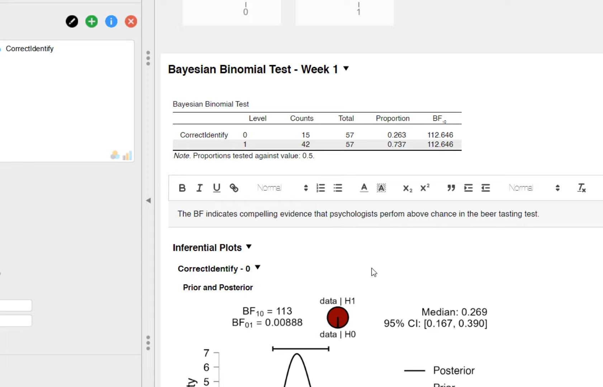{.border1}
:::
::::


## Next level:
### Quarto-Live: Full Reproducibility

**Three lines of code change:**

```yaml
format: live-html
engine: knitr
```

**Result:**

- Completely isolated computational environment
- Accessible via browser
- Executable via WebAssembly
- No software installation needed
- No version conflicts possible


## Fruit 3 `r fontawesome::fa("lemon", height = "55px", prefer_type = "solid", fill = "#FFEE8C")` Compute environment control

\

:::: {.columns}
:::{.column width = "20%" .text-center}
:::
:::{.column width = "25%" .text-center}
**package<br />versions**  
:::
:::{.column width = "25%" .text-center}
**computational<br />environment**
:::
:::{.column width = "25%"}
:::
::::

:::: {.columns}
:::{.column width = "20%" .text-center .border-top1}
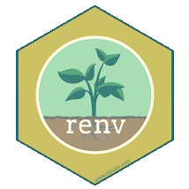{width="60%"}
:::
:::{.column width = "25%" .text-center .border-top1}
\

`r fa("circle-check", fill = "#79B530", height = "80px", prefer_type = "solid")`  
:::
:::{.column width = "25%" .text-center .border-top1}
:::
:::{.column width = "25%"}
:::
::::

:::: {.columns}
:::{.column width = "20%" .text-center .border-top1}
{width="60%"}
:::
:::{.column width = "25%" .text-center .border-top1}
`r fa("circle-check", fill = "#79B530", height = "80px", prefer_type = "solid")`  
:::
:::{.column width = "25%" .text-center .border-top1}
:::
:::{.column width = "25%"}
:::
::::

:::: {.columns}
:::{.column width = "20%" .text-center .border-top1}
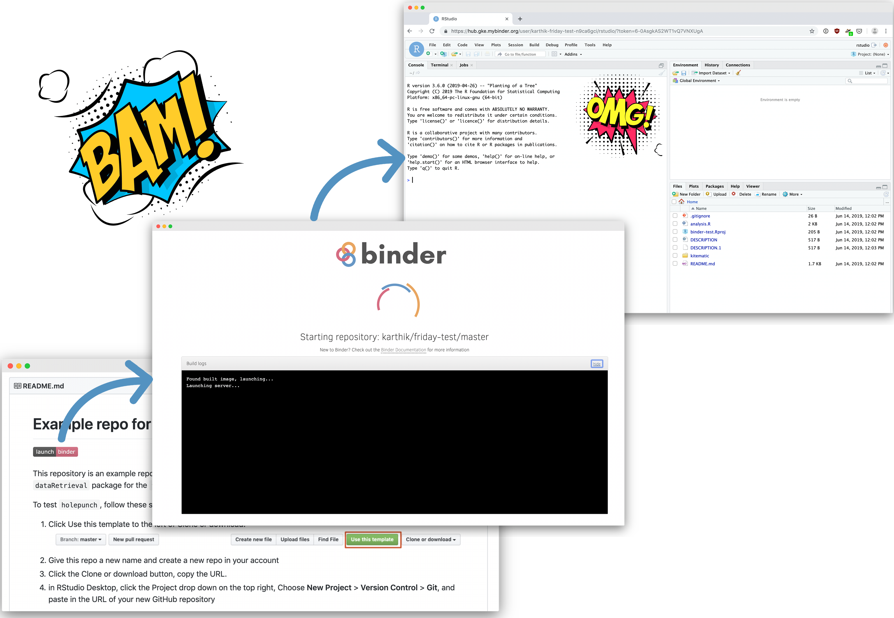{width="60%"}
:::
:::{.column width = "25%" .text-center .border-top1}
:::
:::{.column width = "25%" .text-center .border-top1}
\

`r fa("circle-check", fill = "#79B530", height = "80px", prefer_type = "solid")`  
:::
:::{.column width = "25%"}
:::
::::

## Fruit 3 `r fontawesome::fa("lemon", height = "55px", prefer_type = "solid", fill = "#FFEE8C")` Compute environment control
\

**You**  
let `renv` document your packages
```{r}
#| eval: false
#| echo: true
#| code-block-bg: true
#| code-block-border-left: "#FFEE8C"

renv::init()     # only 1x at any point

renv::snapshot() # documents all used packages 
                 # (re-run only if new packages were installed)
```

\

**Others**  
let `renv` restore this setup
```{r}
#| eval: false
#| echo: true

renv::restore()  # to restore your setup of packages
```


## FAIR Management {.section-title .dark-slide}
**of research products**


## Why FAIR Matters for Reproducibility

\

**Examples of reproducibility barriers I experienced:**

- Data and analyses available, but link was broken → Cannot find
- Link to analysis was active, but inside the paywalled article → Cannot access
- Downloaded analysis script, but it was MPlus → Cannot run
- Ran analyses, but didn't understand which analyses related to which hypotheses → Cannot understand

\

**Availability alone ≠ Reproducibility**


## What is FAIR?

\

::::{.columns}
:::{.column width = "49%"}
### FAIR Principles

- **F**indable
- **A**ccessible
- **I**nteroperable
- **R**eusable

[@wilkinson.2016]

:::
:::{.column width = "49%"}
### FAIR ≠ Open

- FAIR does not necessarily mean "freely accessible"
- Particularly relevant for vulnerable populations
- Metadata remain publicly accessible
- Access path transparently documented

**Principle:** "As open as possible, as closed as necessary" [@europeancommission.2020]
:::
::::


## F - Findable

\

*Just because we provide data and code online, doesn’t mean that others will find it.*

> Being able to consistently locate your research products

\


**My practical suggestions:**

::::{.columns}
:::{.column width = "66%"}

* <span class="highlight-bright">Upload</span> research products and <span class="highlight-bright">get a DOI</span> from a...
  - trusted repsoitory (zenodo.org, osf.io)
  - research data center (&#127465;&#127466; Verbund FDB, &#127482;&#127480; Open ICPSR, &#127468;&#127463; UK Data Archive)

:::
:::{.column width = "33%"}
*Why DOI?*  
`r fa("arrow-right", height = "15px", prefer_type = "solid")` persistent identifier (URLs may change)  
  
*Why repository or rdc?*  
`r fa("arrow-right", height = "15px", prefer_type = "solid")` You may change affiliation  
`r fa("arrow-right", height = "15px", prefer_type = "solid")` Files can easily get lost
:::
::::


:::{.notes}
We could have the greatest reproducible data and code, but if others can't find these products, reproducibility will be of little value.
:::


## F - Findable

\

*Just because we provide data and code online, doesn’t mean that others will find it.*

> Being able to consistently locate your research products

\


**My practical suggestions:**

::::{.columns}
:::{.column width = "66%"}

* <span class="highlight-bright">Upload</span> research products and <span class="highlight-bright">get a DOI</span> from a...
  - trusted repsoitory (zenodo.org, osf.io)
  - research data center (&#127465;&#127466; Verbund FDB, &#127482;&#127480; Open ICPSR, &#127468;&#127463; UK Data Archive)

:::
:::{.column width = "33%"}
*Why DOI?*  
`r fa("arrow-right", height = "15px", prefer_type = "solid")` persistent identifier (URLs may change)  
  
*Why repository or rdc?*  
`r fa("arrow-right", height = "15px", prefer_type = "solid")` You may change affiliation  
`r fa("arrow-right", height = "15px", prefer_type = "solid")` Files can easily get lost
:::
::::

::::{.columns}
:::{.column width = "66%"}

* put DOI <span class="highlight-bright">in Appendix/ Supplement of paper</span>

:::
:::{.column width = "33%"}
*Why not store it with the journal?*  
`r fa("arrow-right", height = "15px", prefer_type = "solid")` you retain control
`r fa("arrow-right", height = "15px", prefer_type = "solid")` multiple projects reliably in one place
:::
::::


## A - Accessible

\

> Encountering as few access barriers as possible when retrieving your research products and understanding how they may be used.

\


**My practical suggestions:**

::::{.columns}
:::{.column width = "66%"}

* Make sure access is as <span class="highlight-bright">open and cheap</span> as possible
  - repositories allow for public and restricted access
  - research data centers offer different levels of access restriction

:::
:::{.column width = "33%"}
*e.g., by providing the DOI in the publicly accessible sections of journal articles that are paywalled*
:::
::::

::::{.columns}
:::{.column width = "66%"}

* Make sure users know if they can access and <span class="highlight-bright">under which conditions</span>

:::
:::{.column width = "33%"}
*e.g., research data centers ensure that terms of use are clear*  
  
*e.g., on repositories provide a readme-file and an open license (e.g., [CC0](https://creativecommons.org/public-domain/cc0/), [CC-BY](https://creativecommons.org/licenses/by/4.0/deed.de), [CC-BY-SA](https://creativecommons.org/licenses/by-sa/4.0/deed.de)) for access cases*
:::
::::


:::{.notes}

* Providing a link to the data analyses in the text of a paywalled journal article
* Unclear licensing / use conditions when providing data (e.g., are non-researchers allowed to access the data or is it only open for qualified researchers?)

:::

## I - Interoperable
\

*Just because others downloaded our data doesn’t mean they can open and manipulate it.*

> Being able to open your data and execute your analyses

\

**My practical suggestions:**

::::{.columns}
:::{.column width = "66%"}

* Use openly licensed <span class="highlight-bright">software</span>
* Use openly licensed <span class="highlight-bright">file formats</span>

:::
:::{.column width = "33%"}
*e.g., R, python, JASP, jamovi (see before)*  
  
*e.g., .odf ([open data format](https://www.konsortswd.de/en/services/open-data-format/)), .RData (labelled R data set), .csv with labelling script*
:::
::::

::::{.columns}
:::{.column width = "66%"}

* Make sure users know how different files <span class="highlight-bright">are related</span> to one another

:::
:::{.column width = "33%"}
*e.g., define which file contains student data and which teacher data*  
  
*e.g., define which file contains data from cohort 1 and which cohort 2, ...*
:::
::::


## R - Reusable

\

*Just because others are able to open, they are not necessarily able to understand the data and analyses.*

> Being able to understand your data and analyses

\

**My practical suggestions:**

::::{.columns}
:::{.column width = "66%"}

* Understanding data: <span class="highlight-bright">add a codebook</span>
* Understanding analyses: Use <span class="highlight-bright">literate programming</span>

:::
:::{.column width = "33%"}
*See the R package [`codebook`](https://cran.r-project.org/web/packages/codebook/readme/README.html) on how to semi-automatically create a codebook*
:::
::::


## FAIRness
### Checklist

\

::::{.columns}
:::{.column width = "15%" .border-top1}
**Findable**
:::
:::{.column width = "25%" .border-top1}
*Being able to consistently locate your research products*
:::
:::{.column width = "59%" .border-top1}

* Upload data and analyses to Zenodo/ OSF and get DOI
* put DOI in Appendix/Supplement of paper

:::
::::

::::{.columns}
:::{.column width = "15%" .border-top1}
**Accessible**
:::
:::{.column width = "25%" .border-top1}
*Encountering as few access barriers as possible when retrieving your research products and understanding how they may be used.*
:::
:::{.column width = "59%" .border-top1}

* make as open as possible
* add licence

:::
::::

::::{.columns}
:::{.column width = "15%" .border-top1}
**Interoperable**
:::
:::{.column width = "25%" .border-top1}
*Being able to open your data and execute your analyses*
:::
:::{.column width = "59%" .border-top1}

* use R/ python/ JASP/ jamovi for analysis
* save data in .odf/ .RData/ .csv

:::
::::

::::{.columns}
:::{.column width = "15%" .border-top1}
**Reusable**
:::
:::{.column width = "25%" .border-top1}
*Being able to understand your data and analyses*
:::
:::{.column width = "59%" .border-top1}

* For data: add a codebook
* For analyses: Use literate programming

:::
::::


## Frequently Raised Concerns {.section-title .dark-slide}


## "Reproducibility sounds time-consuming"

\

**Initial investment:** Yes, there's a learning curve

**Long-term benefits:**

- Faster revisions (code is already there)
- Easier collaboration (others can understand your work)
- Better organized workflow

**Think incremental:** Start small, improve gradually


## "My code is messy and embarrassing"

\

**The paradox of open code:**

1. Knowing others will see it → You write better code
2. Better code → Less error-prone, better documented
3. Better documentation → You and others are able to reuse

**Perfect is the enemy of good:** 
Imperfect but documented code > No code at all


## "What about proprietary/sensitive data?"

\

**FAIR ≠ Open:**

- Metadata can be public even if data isn't
- Controlled access is still FAIR
- Document access procedures transparently

**For educational research:**

- "As open as possible, as closed as necessary"
- Research data centers provide secure solutions
- Synthetic data for methods illustration


## "I'll be scooped!"

\

**Your advantages persist:**

- Deep knowledge of your data and design
- First-mover advantage in publication
- Invitations to collaborate on reuse

**Reframing:**

- Reuse = validation of your work
- Citations from secondary analyses
- Broader impact of your research

**Science as common good:** Collective progress benefits everyone


## Conclusion

\

**Reproducibility is...**

* core to science
* anything but a given - many potential points of failure

\

**Two practical approaches:**

1. <span class="highlight-bright">Reproducible Reporting</span> → raises chances of successful & sustainable analyses
2. <span class="highlight-bright">FAIR Data Management</span> → make reuse systematic, not accidental


## What are your next steps?
\

**For your next paper:** Plan one step forward on the Reproducibility Spectrum

\

**An example:**

:::: {.columns}
:::{.column width="16%" .text-center}
:::
:::{.column width="16%" .text-center}
use JASP
:::
:::{.column width="16%" .text-center}
shared project file on zenodo
:::
:::{.column width="16%" .text-center}
link DOI in Appendix
:::
:::{.column width="16%" .text-center}
add notes to JASP output
:::
:::{.column width="16%" .text-center}
add codebook
:::
::::


:::: {.columns}
:::{.column width="16%" .text-center}
*Paper1*
:::
:::{.column width="16%" .text-center .border-top1}
`r fa("circle-check", fill="#79B530", height="45px", prefer_type="solid")`
:::
:::{.column width="16%" .text-center .border-top1}
:::
:::{.column width="16%" .text-center .border-top1}
:::
:::{.column width="16%" .text-center .border-top1}
:::
:::{.column width="16%" .text-center .border-top1}
:::
::::


:::: {.columns}
:::{.column width="16%" .text-center}
*Paper2*
:::
:::{.column width="16%" .text-center .border-top1}
`r fa("circle-check", fill="#79B530", height="45px", prefer_type="solid")`
:::
:::{.column width="16%" .text-center .border-top1}
`r fa("circle-check", fill="#79B530", height="45px", prefer_type="solid")`
:::
:::{.column width="16%" .text-center .border-top1}
:::
:::{.column width="16%" .text-center .border-top1}
:::
:::{.column width="16%" .text-center .border-top1}
:::
::::


:::: {.columns}
:::{.column width="16%" .text-center}
*Paper3*
:::
:::{.column width="16%" .text-center .border-top1}
`r fa("circle-check", fill="#79B530", height="45px", prefer_type="solid")`
:::
:::{.column width="16%" .text-center .border-top1}
`r fa("circle-check", fill="#79B530", height="45px", prefer_type="solid")`
:::
:::{.column width="16%" .text-center .border-top1}
`r fa("circle-check", fill="#79B530", height="45px", prefer_type="solid")`
:::
:::{.column width="16%" .text-center .border-top1}
:::
:::{.column width="16%" .text-center .border-top1}
:::
::::


:::: {.columns}
:::{.column width="16%" .text-center}
*Paper4*
:::
:::{.column width="16%" .text-center .border-top1}
`r fa("circle-check", fill="#79B530", height="45px", prefer_type="solid")`
:::
:::{.column width="16%" .text-center .border-top1}
`r fa("circle-check", fill="#79B530", height="45px", prefer_type="solid")`
:::
:::{.column width="16%" .text-center .border-top1}
`r fa("circle-check", fill="#79B530", height="45px", prefer_type="solid")`
:::
:::{.column width="16%" .text-center .border-top1}
`r fa("circle-check", fill="#79B530", height="45px", prefer_type="solid")`
:::
:::{.column width="16%" .text-center .border-top1}
:::
::::


:::: {.columns}
:::{.column width="16%" .text-center}
*Paper5*
:::
:::{.column width="16%" .text-center .border-top1}
`r fa("circle-check", fill="#79B530", height="45px", prefer_type="solid")`
:::
:::{.column width="16%" .text-center .border-top1}
`r fa("circle-check", fill="#79B530", height="45px", prefer_type="solid")`
:::
:::{.column width="16%" .text-center .border-top1}
`r fa("circle-check", fill="#79B530", height="45px", prefer_type="solid")`
:::
:::{.column width="16%" .text-center .border-top1}
`r fa("circle-check", fill="#79B530", height="45px", prefer_type="solid")`
:::
:::{.column width="16%" .text-center .border-top1}
`r fa("circle-check", fill="#79B530", height="45px", prefer_type="solid")`
:::
::::


## What are your next steps?
\

**For your next paper:** Plan one step forward on the Reproducibility Spectrum

\

**An example:**

:::: {.columns}
:::{.column width="14%" .text-center}
:::
:::{.column width="14%" .text-center}
shared code and data on zenodo
:::
:::{.column width="14%" .text-center}
link DOI in Appendix
:::
:::{.column width="14%" .text-center}
R for data analysis
:::
:::{.column width="14%" .text-center}
use Quarto-document
:::
:::{.column width="14%" .text-center}
use renv
:::
:::{.column width="14%" .text-center}
add codebook
:::
::::


:::: {.columns}
:::{.column width="14%" .text-center}
*Paper1*
:::
:::{.column width="14%" .text-center .border-top1}
`r fa("circle-check", fill="#79B530", height="45px", prefer_type="solid")`
:::
:::{.column width="14%" .text-center .border-top1}
:::
:::{.column width="14%" .text-center .border-top1}
:::
:::{.column width="14%" .text-center .border-top1}
:::
:::{.column width="14%" .text-center .border-top1}
:::
:::{.column width="14%" .text-center .border-top1}
:::
::::


:::: {.columns}
:::{.column width="14%" .text-center}
*Paper2*
:::
:::{.column width="14%" .text-center .border-top1}
`r fa("circle-check", fill="#79B530", height="45px", prefer_type="solid")`
:::
:::{.column width="14%" .text-center .border-top1}
`r fa("circle-check", fill="#79B530", height="45px", prefer_type="solid")`
:::
:::{.column width="14%" .text-center .border-top1}
:::
:::{.column width="14%" .text-center .border-top1}
:::
:::{.column width="14%" .text-center .border-top1}
:::
:::{.column width="14%" .text-center .border-top1}
:::
::::


:::: {.columns}
:::{.column width="14%" .text-center}
*Paper3*
:::
:::{.column width="14%" .text-center .border-top1}
`r fa("circle-check", fill="#79B530", height="45px", prefer_type="solid")`
:::
:::{.column width="14%" .text-center .border-top1}
`r fa("circle-check", fill="#79B530", height="45px", prefer_type="solid")`
:::
:::{.column width="14%" .text-center .border-top1}
`r fa("circle-check", fill="#79B530", height="45px", prefer_type="solid")`
:::
:::{.column width="14%" .text-center .border-top1}
:::
:::{.column width="14%" .text-center .border-top1}
:::
:::{.column width="14%" .text-center .border-top1}
:::
::::


:::: {.columns}
:::{.column width="14%" .text-center}
*Paper4*
:::
:::{.column width="14%" .text-center .border-top1}
`r fa("circle-check", fill="#79B530", height="45px", prefer_type="solid")`
:::
:::{.column width="14%" .text-center .border-top1}
`r fa("circle-check", fill="#79B530", height="45px", prefer_type="solid")`
:::
:::{.column width="14%" .text-center .border-top1}
`r fa("circle-check", fill="#79B530", height="45px", prefer_type="solid")`
:::
:::{.column width="14%" .text-center .border-top1}
`r fa("circle-check", fill="#79B530", height="45px", prefer_type="solid")`
:::
:::{.column width="14%" .text-center .border-top1}
:::
:::{.column width="14%" .text-center .border-top1}
:::
::::


:::: {.columns}
:::{.column width="14%" .text-center}
*Paper5*
:::
:::{.column width="14%" .text-center .border-top1}
`r fa("circle-check", fill="#79B530", height="45px", prefer_type="solid")`
:::
:::{.column width="14%" .text-center .border-top1}
`r fa("circle-check", fill="#79B530", height="45px", prefer_type="solid")`
:::
:::{.column width="14%" .text-center .border-top1}
`r fa("circle-check", fill="#79B530", height="45px", prefer_type="solid")`
:::
:::{.column width="14%" .text-center .border-top1}
`r fa("circle-check", fill="#79B530", height="45px", prefer_type="solid")`
:::
:::{.column width="14%" .text-center .border-top1}
`r fa("circle-check", fill="#79B530", height="45px", prefer_type="solid")`
:::
:::{.column width="14%" .text-center .border-top1}
:::
::::


:::: {.columns}
:::{.column width="14%" .text-center}
*Paper6*
:::
:::{.column width="14%" .text-center .border-top1}
`r fa("circle-check", fill="#79B530", height="45px", prefer_type="solid")`
:::
:::{.column width="14%" .text-center .border-top1}
`r fa("circle-check", fill="#79B530", height="45px", prefer_type="solid")`
:::
:::{.column width="14%" .text-center .border-top1}
`r fa("circle-check", fill="#79B530", height="45px", prefer_type="solid")`
:::
:::{.column width="14%" .text-center .border-top1}
`r fa("circle-check", fill="#79B530", height="45px", prefer_type="solid")`
:::
:::{.column width="14%" .text-center .border-top1}
`r fa("circle-check", fill="#79B530", height="45px", prefer_type="solid")`
:::
:::{.column width="14%" .text-center .border-top1}
`r fa("circle-check", fill="#79B530", height="45px", prefer_type="solid")`
:::
::::


## Thank You {.section-title .dark-slide}
\

**Jürgen Schneider**  
\

<juergen.schneider@ph-karlsruhe.de>  
{width="20%"}


## References

::: {#refs}
:::


## Credit

Title image by <a href="https://unsplash.com/de/@raelframes?utm_source=unsplash&utm_medium=referral&utm_content=creditCopyText">rael frames</a> on <a href="https://unsplash.com/de/fotos/bundel-reifer-bananen-hangen-an-einem-marktstand-sVBMKFR4f_U?utm_source=unsplash&utm_medium=referral&utm_content=creditCopyText">Unsplash</a>
      
Olaf (from Frozen): [dailymail.co.uk](https://www.dailymail.co.uk/lifestyle/article-10057879/Social-media-users-share-hilarious-snaps-biggest-baking-disasters-theyve-encountered.html)  
  
FAIR-Logo: SangyaPundir on [wikimedia commons](https://commons.wikimedia.org/wiki/File:FAIR_data_principles.jpg)